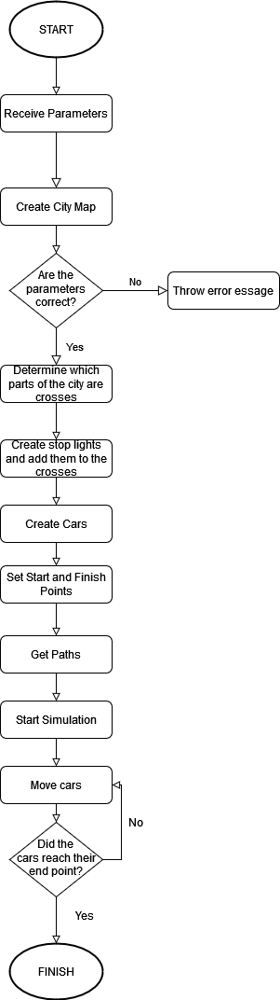

Architecture- Traffic Simulator
====================================

Introduction
----------------------
This project consists in the creation of a simulator that will demonstrate how cars will move across a city
from a specific point to another following a certain path. During the transportation, the cars will encounter
stop lights and, depending on their state they will continue or stop. Also, they cars can find other cars on
the way, which means that they will have to slow down and let other cars move first before continuing their path.

Programming Language
----------------------
We decided to use the Go programming language for our implementation because, since this is a problem that requires 
concurrent programming, we concluded thatmany of the tools that the language provides such as structs, goroutines and 
channels would be fundamental to manage not only the movement ofthe cars, but also the communication between them as well 
as the behavior of stop lights.

Flow of the Program
----------------------

Challenges and Limitations
----------------------
Our biggest challenge was handling the behavior of the cars. Once we had a starting and end point, we had to determine how are 
they going to find the path to get there. We chose to use a BFS algorithm for this. We were not intending to find an optimal
route because we wanted to explore the possible scenarios that we could find by encountering stop lights and other cars. 

On the other hand, we were limited by not having an easy form of creating a GUI using Go. Other languages and even IDEs have
straight forward ways of displaying shapes and images, but this was not our case. In the end, we managed to display everything 
using normal strings. 

Conclusion
----------------------
Finally, we want to mention that with this project we learned about complexity of concurrent programming and, at the same, we 
understood how useful in can be since it allows as to create faster programs and creates a world of possibilities for problem solving
